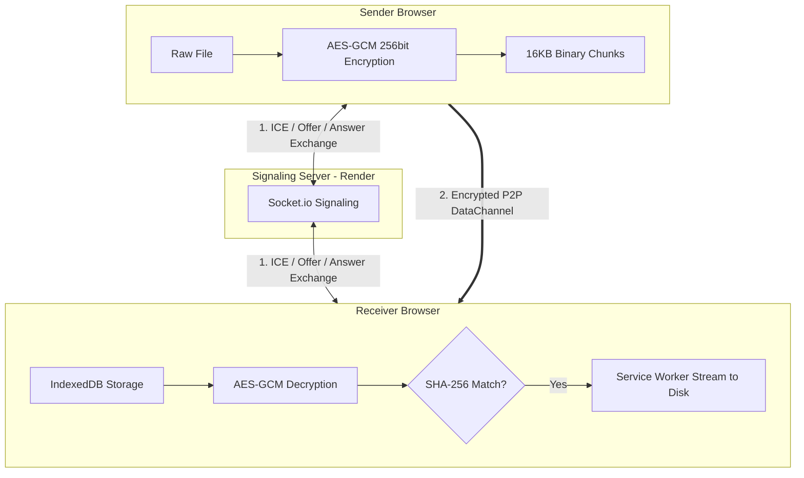
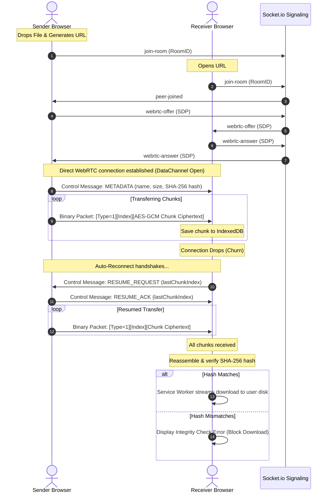

# P2P Web Share

A production-ready, decentralized, browser-to-browser file sharing application leveraging WebRTC DataChannels. Absolutely zero file bytes are uploaded to or stored on any central server.

---

## 🚀 The Problem It Solves

Traditional file sharing systems (like email attachments, cloud drives, or messaging apps) require you to upload your files to a centralized cloud server. This introduces:
1. **Privacy Concerns:** Centralized servers can read, index, or store your sensitive personal/business data.
2. **Speed Bottlenecks:** Files must be uploaded to the server first, then downloaded by the recipient, double-spending bandwidth and capping speeds.
3. **Storage/Cost Limits:** Centralized servers impose strict size ceilings or require expensive subscriptions.

**WebShare P2P** bypasses the server entirely. Once a direct peer connection is negotiated via a lightweight signaling server, files stream directly from browser-to-browser. 

---

## ✨ Features

### Core Features
* **Zero-Cloud Storage:** File packets are sent directly between browsers using `RTCDataChannel`. No file data touches the signaling server.
* **Instant share link:** Drag a file, click to generate a unique share room link, and send it to your peer.
* **Lightweight Node/Socket.io signaling:** The server handles only WebRTC negotiation coordinates (Offers, Answers, ICE candidates) and discards room states once peers disconnect.
* **SHA-256 Checksum Verification:** The sender hashes the entire file in-browser using Web Crypto before transmission. The receiver verifies the compiled hash upon completion. If a mismatch is detected, download is blocked.
* **Real-time Transfer Analytics:** Visual progress bars, live transfer speed indicator (MB/s), and active ETA counters.
* **Graceful Disconnect Recovery:** Detects peer dropouts natively via Socket.io and `RTCPeerConnection` states, pausing without crashing.
* **Auto-Download:** Instantly triggers download with preserved original names and extensions on verification success.

### Advanced Bonus Features
* **Zero-Knowledge Encryption:** Files are encrypted in-browser using **AES-GCM (256-bit)**. The cryptographic key remains strictly inside the browser URL hash fragment (`#key=...`) and is never sent to the signaling server.
* **IndexedDB Multi-GB File Support:** Files are streamed chunk-by-chunk directly into browser IndexedDB storage instead of accumulating in system RAM.
* **Service Worker Streaming Downloads:** Downloads are piped directly from IndexedDB using a `ReadableStream` intercepted by a Service Worker, avoiding browser memory crashes for files over 500MB.
* **Auto-Resume (Connection Churn Recovery):** The receiver tracks chunk progress in local database. If connection drops, the receiver automatically requests the sender to resume from the last successful chunk index on reconnect.

---

## 🛠️ Tech Stack & Versions

* **Frontend:** React 18.3.1, Vite 5.4.11, Tailwind CSS 3.4.3, Lucide React 0.378.0
* **Signaling Backend:** Node.js 22+, Express 4.19.2, Socket.io 4.7.5
* **P2P Layer:** WebRTC Native DataChannels (`RTCPeerConnection`)
* **Security:** Web Crypto API (SubtleCrypto SHA-256 & AES-GCM 256-bit)
* **Local Caching:** IndexedDB + Service Worker API

---

## 🏗️ Architecture & Flow Diagrams

### 1. System Topology


### 2. Complete Transfer & Resuming Protocol


---

## ⚙️ Environment Variables

### Client (`client/.env` or Vercel Config)
```env
VITE_SIGNALING_SERVER_URL=http://localhost:5000
```

### Server (`server/.env` or Render Config)
```env
PORT=5000
FRONTEND_URL=http://localhost:5173
```

---

## ⚡ Local Setup Instructions

### 1. Clone & Setup Signaling Server
```bash
# Navigate to server folder
cd server

# Install dependencies
npm install

# Start development server (using nodemon)
npm run dev
```
The server will start listening on `http://localhost:5000`.

### 2. Setup React Client
```bash
# Open a new terminal and navigate to client folder
cd client

# Install dependencies
npm install

# Start dev server
npm run dev
```
The Vite development server will spin up on `http://localhost:5173`. Open this URL in two separate browser windows (or on separate devices) to test local sharing.

---

## 🔒 Security: How Zero-Knowledge Works
1. **Key Generation:** When the sender starts a room, a 256-bit AES-GCM key is generated using `crypto.subtle.generateKey` inside the sender's sandbox.
2. **Key Placement:** This key is serialized as a URL-safe base64 string and appended as a hash fragment to the URL (e.g. `http://domain.com/room/<uuid>#key=XYZ...`).
3. **Zero Server Knowledge:** According to RFC 3986, browsers *never* transmit the hash fragment (`#key=...`) to the server during HTTP requests. Therefore, the signaling Node.js server sees only `/room/<uuid>` and holds absolutely no decryption capability.
4. **Decryption:** When the receiver opens the link, their browser parses `window.location.hash`, imports the key back to a Web Crypto object, and decrypts incoming chunks locally in memory prior to compiling and writing.

---

## 🔗 Deployments

* **Deployed Frontend (Vercel):** *[Insert Deployed Client URL here]*
* **Deployed Backend (Render):** *[Insert Deployed Server URL here]*
* **Demo Video Link:** *https://drive.google.com/file/d/1C8oHAoI5Z72Lan_9Pis-1iJkCpOljqhU/view?usp=sharing*
